# IEDL visual gallery

113 examples · 106 local renders. This page renders directly on GitHub.

[Setup and rebuild](README.md) · [Interactive HTML](index.html) (open locally for sliders/search) · [Execution results](results.json)

Images below are actual saved renders. Open an image for a larger view; each example links to its editable recipe. Remote examples have no generated preview. These are capability demonstrations, not universal corrections.

**Local masks:** geometric masks and retouch coordinates were drawn for the concert example. Adapt them to each new photograph; they do not locate subjects automatically. Skin examples cover selected arm regions; sky and red-eye demonstrations need suitable targets.

## Categories

- [Start here](#category-1)
- [Adjustments](#category-2)
- [Presets](#category-3)
- [Curves &amp; HSL](#category-4)
- [Masks](#category-5)
- [Layers](#category-6)
- [Geometry](#category-7)
- [Retouch &amp; liquify](#category-8)
- [Analysis &amp; automation](#category-9)
- [Output &amp; assets](#category-10)
- [Authenticated APIs](#category-11)

## Start here

### Stage lights, gently balanced

**Rendered** — A restrained interpretation of mixed stage light, not a neutral-light reconstruction. Hand-drawn subject region.

| Original | Edited |
| --- | --- |
|  |  |

[Recipe](recipes/stage-balance.iedl) · [Full image](images/stage-balance.jpg) · [Resolved report](resolved/stage-balance.json) · [Mask](masks/stage-balance.png) · [Replay bundle](bundles/stage-balance.iedl.zip)

## Adjustments

### exposure 0.5

**Rendered** — One slider at a time; intentionally visible settings. Noise/detail effects may be subtle on this downsampled JPEG.

| Original | Edited |
| --- | --- |
|  | 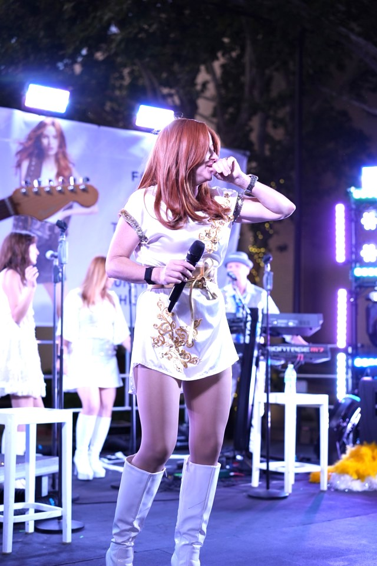 |

[Recipe](recipes/adjust-exposure.iedl) · [Full image](images/adjust-exposure.jpg) · [Resolved report](resolved/adjust-exposure.json)

### contrast 25

**Rendered** — One slider at a time; intentionally visible settings. Noise/detail effects may be subtle on this downsampled JPEG.

| Original | Edited |
| --- | --- |
|  |  |

[Recipe](recipes/adjust-contrast.iedl) · [Full image](images/adjust-contrast.jpg) · [Resolved report](resolved/adjust-contrast.json)

### highlights -55

**Rendered** — One slider at a time; intentionally visible settings. Noise/detail effects may be subtle on this downsampled JPEG.

| Original | Edited |
| --- | --- |
|  |  |

[Recipe](recipes/adjust-highlights.iedl) · [Full image](images/adjust-highlights.jpg) · [Resolved report](resolved/adjust-highlights.json)

### shadows 35

**Rendered** — One slider at a time; intentionally visible settings. Noise/detail effects may be subtle on this downsampled JPEG.

| Original | Edited |
| --- | --- |
|  | 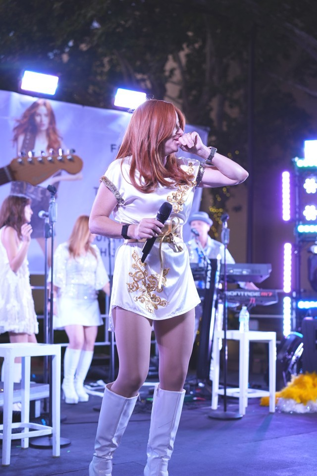 |

[Recipe](recipes/adjust-shadows.iedl) · [Full image](images/adjust-shadows.jpg) · [Resolved report](resolved/adjust-shadows.json)

### whites -35

**Rendered** — One slider at a time; intentionally visible settings. Noise/detail effects may be subtle on this downsampled JPEG.

| Original | Edited |
| --- | --- |
|  |  |

[Recipe](recipes/adjust-whites.iedl) · [Full image](images/adjust-whites.jpg) · [Resolved report](resolved/adjust-whites.json)

### blacks -25

**Rendered** — One slider at a time; intentionally visible settings. Noise/detail effects may be subtle on this downsampled JPEG.

| Original | Edited |
| --- | --- |
|  |  |

[Recipe](recipes/adjust-blacks.iedl) · [Full image](images/adjust-blacks.jpg) · [Resolved report](resolved/adjust-blacks.json)

### temperature 25

**Rendered** — One slider at a time; intentionally visible settings. Noise/detail effects may be subtle on this downsampled JPEG.

| Original | Edited |
| --- | --- |
|  |  |

[Recipe](recipes/adjust-temperature.iedl) · [Full image](images/adjust-temperature.jpg) · [Resolved report](resolved/adjust-temperature.json)

### tint -25

**Rendered** — One slider at a time; intentionally visible settings. Noise/detail effects may be subtle on this downsampled JPEG.

| Original | Edited |
| --- | --- |
|  | 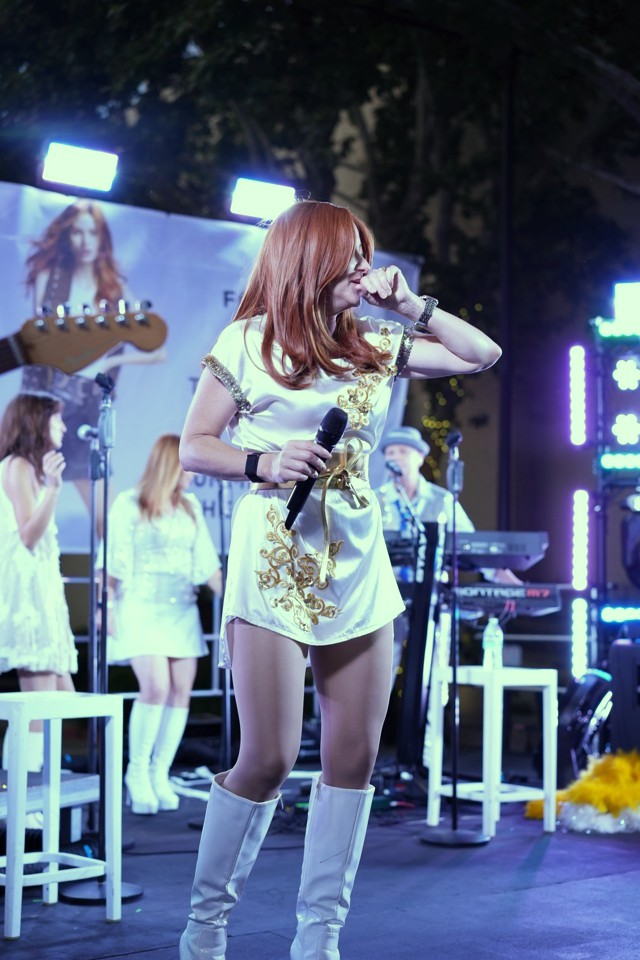 |

[Recipe](recipes/adjust-tint.iedl) · [Full image](images/adjust-tint.jpg) · [Resolved report](resolved/adjust-tint.json)

### saturation -35

**Rendered** — One slider at a time; intentionally visible settings. Noise/detail effects may be subtle on this downsampled JPEG.

| Original | Edited |
| --- | --- |
|  |  |

[Recipe](recipes/adjust-saturation.iedl) · [Full image](images/adjust-saturation.jpg) · [Resolved report](resolved/adjust-saturation.json)

### vibrance 25

**Rendered** — One slider at a time; intentionally visible settings. Noise/detail effects may be subtle on this downsampled JPEG.

| Original | Edited |
| --- | --- |
|  |  |

[Recipe](recipes/adjust-vibrance.iedl) · [Full image](images/adjust-vibrance.jpg) · [Resolved report](resolved/adjust-vibrance.json)

### texture 30

**Rendered** — One slider at a time; intentionally visible settings. Noise/detail effects may be subtle on this downsampled JPEG.

| Original | Edited |
| --- | --- |
|  |  |

[Recipe](recipes/adjust-texture.iedl) · [Full image](images/adjust-texture.jpg) · [Resolved report](resolved/adjust-texture.json)

### clarity 25

**Rendered** — One slider at a time; intentionally visible settings. Noise/detail effects may be subtle on this downsampled JPEG.

| Original | Edited |
| --- | --- |
|  |  |

[Recipe](recipes/adjust-clarity.iedl) · [Full image](images/adjust-clarity.jpg) · [Resolved report](resolved/adjust-clarity.json)

### dehaze 25

**Rendered** — One slider at a time; intentionally visible settings. Noise/detail effects may be subtle on this downsampled JPEG.

| Original | Edited |
| --- | --- |
|  |  |

[Recipe](recipes/adjust-dehaze.iedl) · [Full image](images/adjust-dehaze.jpg) · [Resolved report](resolved/adjust-dehaze.json)

### sharpening 55

**Rendered** — One slider at a time; intentionally visible settings. Noise/detail effects may be subtle on this downsampled JPEG.

| Original | Edited |
| --- | --- |
|  |  |

[Recipe](recipes/adjust-sharpening.iedl) · [Full image](images/adjust-sharpening.jpg) · [Resolved report](resolved/adjust-sharpening.json)

### denoise 50

**Rendered** — One slider at a time; intentionally visible settings. Noise/detail effects may be subtle on this downsampled JPEG.

| Original | Edited |
| --- | --- |
|  |  |

[Recipe](recipes/adjust-denoise.iedl) · [Full image](images/adjust-denoise.jpg) · [Resolved report](resolved/adjust-denoise.json)

### colorNoise 50

**Rendered** — One slider at a time; intentionally visible settings. Noise/detail effects may be subtle on this downsampled JPEG.

| Original | Edited |
| --- | --- |
|  |  |

[Recipe](recipes/adjust-colorNoise.iedl) · [Full image](images/adjust-colorNoise.jpg) · [Resolved report](resolved/adjust-colorNoise.json)

## Presets

### Skin smooth @1

**Rendered** — Gentle denoise and reduced texture inside an explicit skin mask. Inspect eyes, lips, hair and edges. Uses a hand-drawn skin demonstration mask, not AI segmentation. Skin example only covers arms, not a complete skin selection.

| Original | Edited |
| --- | --- |
|  |  |

[Recipe](recipes/preset-skin-smooth-1.iedl) · [Full image](images/preset-skin-smooth-1.jpg) · [Resolved report](resolved/preset-skin-smooth-1.json) · [Mask](masks/preset-skin-smooth-1.png) · [Replay bundle](bundles/preset-skin-smooth-1.iedl.zip)

### Subject Pop

**Rendered** — Lift exposure, clarity and vibrance inside an explicit subject mask. Inspect selection edges. Uses a hand-drawn subject region; inspect edges.

| Original | Edited |
| --- | --- |
|  |  |

[Recipe](recipes/preset-subject-pop-1.iedl) · [Full image](images/preset-subject-pop-1.jpg) · [Resolved report](resolved/preset-subject-pop-1.json) · [Mask](masks/preset-subject-pop-1.png) · [Replay bundle](bundles/preset-subject-pop-1.iedl.zip)

### B&amp;W Classic

**Rendered** — Neutral monochrome with moderate contrast and preserved highlights. Use strength 1 for full black and white.

| Original | Edited |
| --- | --- |
|  | 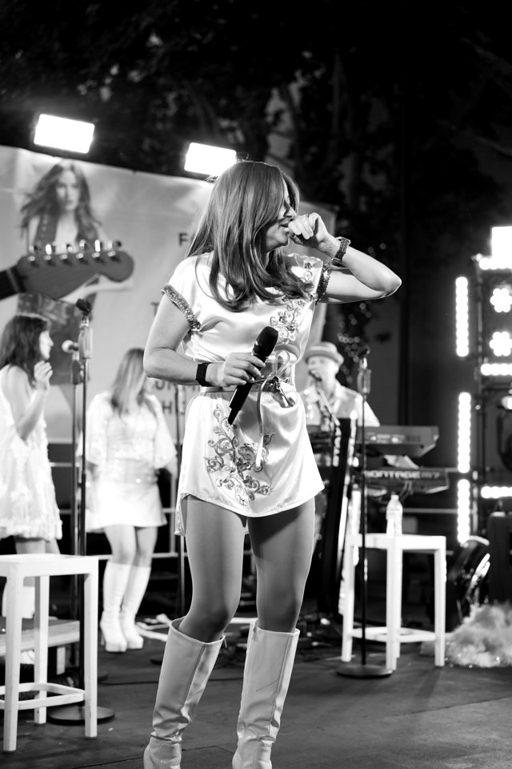 |

[Recipe](recipes/preset-bw-classic-1.iedl) · [Full image](images/preset-bw-classic-1.jpg) · [Resolved report](resolved/preset-bw-classic-1.json)

### B&amp;W High Contrast

**Rendered** — Deep blacks and a stronger contrast curve for graphic monochrome. Use strength 1 for full black and white.

| Original | Edited |
| --- | --- |
|  |  |

[Recipe](recipes/preset-bw-high-contrast-1.iedl) · [Full image](images/preset-bw-high-contrast-1.jpg) · [Resolved report](resolved/preset-bw-high-contrast-1.json)

### B&amp;W Matte

**Rendered** — Soft monochrome with lifted blacks and compressed highlights. Use strength 1 for full black and white.

| Original | Edited |
| --- | --- |
|  | 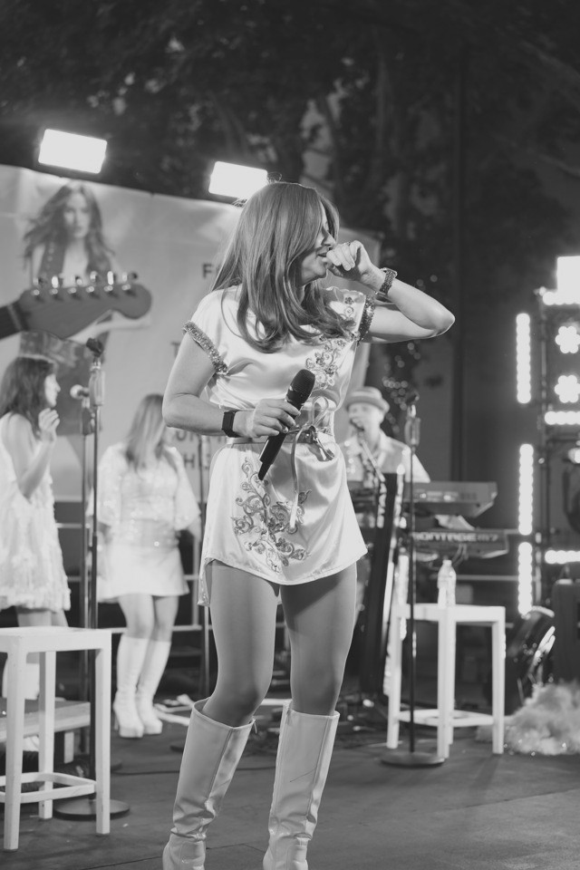 |

[Recipe](recipes/preset-bw-matte-1.iedl) · [Full image](images/preset-bw-matte-1.jpg) · [Resolved report](resolved/preset-bw-matte-1.json)

### Teal &amp; Orange

**Rendered** — Channel curves cool shadows toward teal and warm highlights toward orange. This is tonal grading, not skin detection.

| Original | Edited |
| --- | --- |
|  | 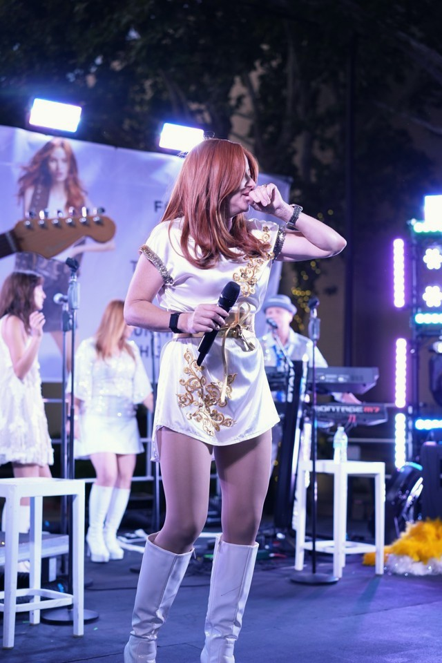 |

[Recipe](recipes/preset-teal-orange-1.iedl) · [Full image](images/preset-teal-orange-1.jpg) · [Resolved report](resolved/preset-teal-orange-1.json)

### Cinematic

**Rendered** — Restrained saturation, soft blacks, cool shadows and warm highlights. Keeps your original framing.

| Original | Edited |
| --- | --- |
|  | 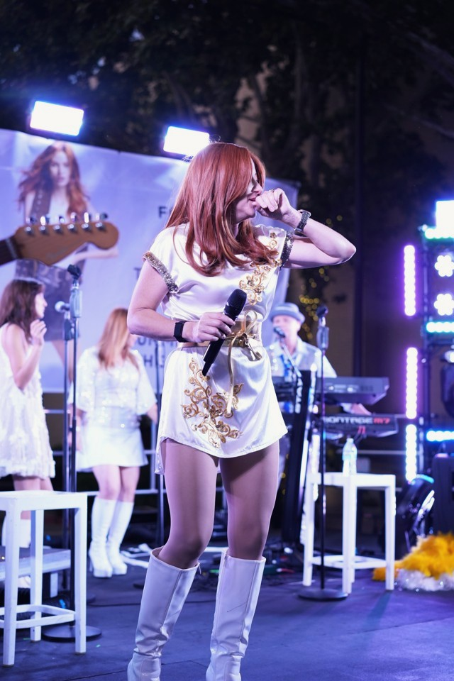 |

[Recipe](recipes/preset-cinematic-1.iedl) · [Full image](images/preset-cinematic-1.jpg) · [Resolved report](resolved/preset-cinematic-1.json)

### Wedding Clean

**Rendered** — Neutral whites, gentle contrast and restrained color. Review white clothing and skin tones.

| Original | Edited |
| --- | --- |
|  |  |

[Recipe](recipes/preset-wedding-clean-1.iedl) · [Full image](images/preset-wedding-clean-1.jpg) · [Resolved report](resolved/preset-wedding-clean-1.json)

### Wedding Airy

**Rendered** — Brighter midtones, soft shadows and delicate highlights. Set exposure for each image first.

| Original | Edited |
| --- | --- |
|  |  |

[Recipe](recipes/preset-wedding-airy-1.iedl) · [Full image](images/preset-wedding-airy-1.jpg) · [Resolved report](resolved/preset-wedding-airy-1.json)

### Golden Romance

**Rendered** — Warm highlights, softened greens and gentle contrast for outdoor portraits.

| Original | Edited |
| --- | --- |
|  |  |

[Recipe](recipes/preset-golden-romance-1.iedl) · [Full image](images/preset-golden-romance-1.jpg) · [Resolved report](resolved/preset-golden-romance-1.json)

### Editorial Portrait

**Rendered** — Clean color, deeper blacks and defined midtones without skin smoothing.

| Original | Edited |
| --- | --- |
|  | 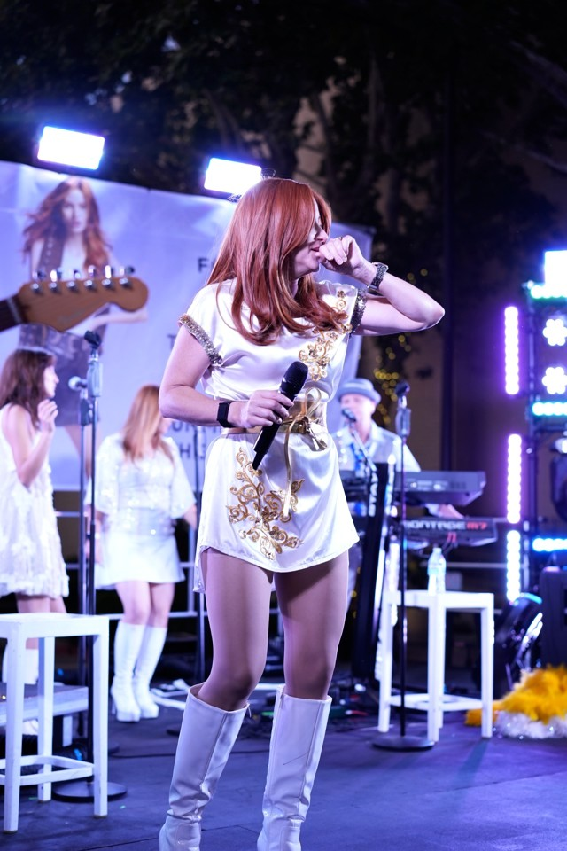 |

[Recipe](recipes/preset-editorial-portrait-1.iedl) · [Full image](images/preset-editorial-portrait-1.jpg) · [Resolved report](resolved/preset-editorial-portrait-1.json)

### Soft Pastel

**Rendered** — Soft contrast and subdued colors without an added pink cast or skin smoothing.

| Original | Edited |
| --- | --- |
|  |  |

[Recipe](recipes/preset-soft-pastel-1.iedl) · [Full image](images/preset-soft-pastel-1.jpg) · [Resolved report](resolved/preset-soft-pastel-1.json)

### Indoor Celebration

**Rendered** — Lift shadows and control bright highlights. Correct mixed-light white balance separately.

| Original | Edited |
| --- | --- |
|  |  |

[Recipe](recipes/preset-indoor-celebration-1.iedl) · [Full image](images/preset-indoor-celebration-1.jpg) · [Resolved report](resolved/preset-indoor-celebration-1.json)

### Family Natural

**Rendered** — Balanced contrast and gentle vibrance with minimal stylization. Keeps skin texture.

| Original | Edited |
| --- | --- |
|  |  |

[Recipe](recipes/preset-family-natural-1.iedl) · [Full image](images/preset-family-natural-1.jpg) · [Resolved report](resolved/preset-family-natural-1.json)

### Autumn Warmth

**Rendered** — Warm earth tones and restrained greens. Review orange clothing and skin tones.

| Original | Edited |
| --- | --- |
|  |  |

[Recipe](recipes/preset-autumn-warmth-1.iedl) · [Full image](images/preset-autumn-warmth-1.jpg) · [Resolved report](resolved/preset-autumn-warmth-1.json)

### Landscape Crisp

**Rendered** — Moderate dehaze and texture with richer blues and greens. Inspect edges for halos.

| Original | Edited |
| --- | --- |
|  | 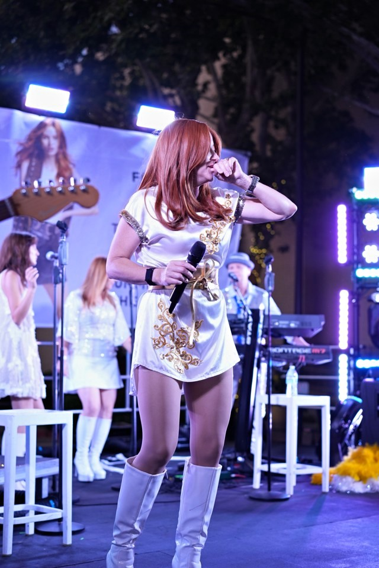 |

[Recipe](recipes/preset-landscape-crisp-1.iedl) · [Full image](images/preset-landscape-crisp-1.jpg) · [Resolved report](resolved/preset-landscape-crisp-1.json)

### Woodland Soft

**Rendered** — Soft highlights, muted greens and subtle warmth for forest scenes.

| Original | Edited |
| --- | --- |
|  |  |

[Recipe](recipes/preset-woodland-soft-1.iedl) · [Full image](images/preset-woodland-soft-1.jpg) · [Resolved report](resolved/preset-woodland-soft-1.json)

### Night Sky Natural

**Rendered** — Restrained tonal contrast and color. No denoise or sharpening; inspect stars at full resolution.

| Original | Edited |
| --- | --- |
|  |  |

[Recipe](recipes/preset-night-sky-natural-1.iedl) · [Full image](images/preset-night-sky-natural-1.jpg) · [Resolved report](resolved/preset-night-sky-natural-1.json)

### Milky Way Definition

**Rendered** — Gentle contrast and dehaze inside an explicit sky mask. No denoise or sharpening; inspect stars and sky boundaries. Uses a hand-drawn dark background region, not a sky/star selection. This concert is not an astrophotography quality test.

| Original | Edited |
| --- | --- |
|  | 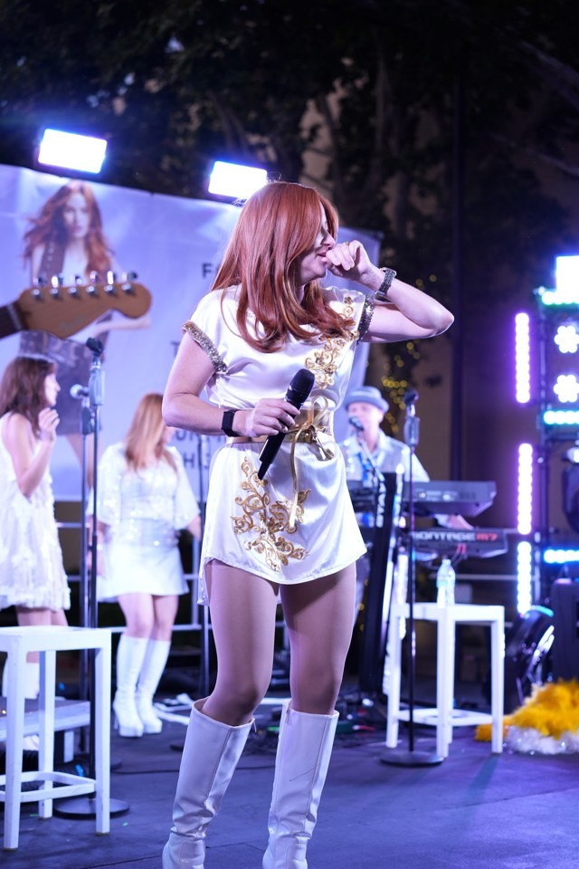 |

[Recipe](recipes/preset-milky-way-definition-1.iedl) · [Full image](images/preset-milky-way-definition-1.jpg) · [Resolved report](resolved/preset-milky-way-definition-1.json) · [Mask](masks/preset-milky-way-definition-1.png) · [Replay bundle](bundles/preset-milky-way-definition-1.iedl.zip)

### Dark &amp; Moody

**Rendered** — Lower exposure, deeper blacks and subdued greens and blues. Check shadow detail before accepting.

| Original | Edited |
| --- | --- |
|  | 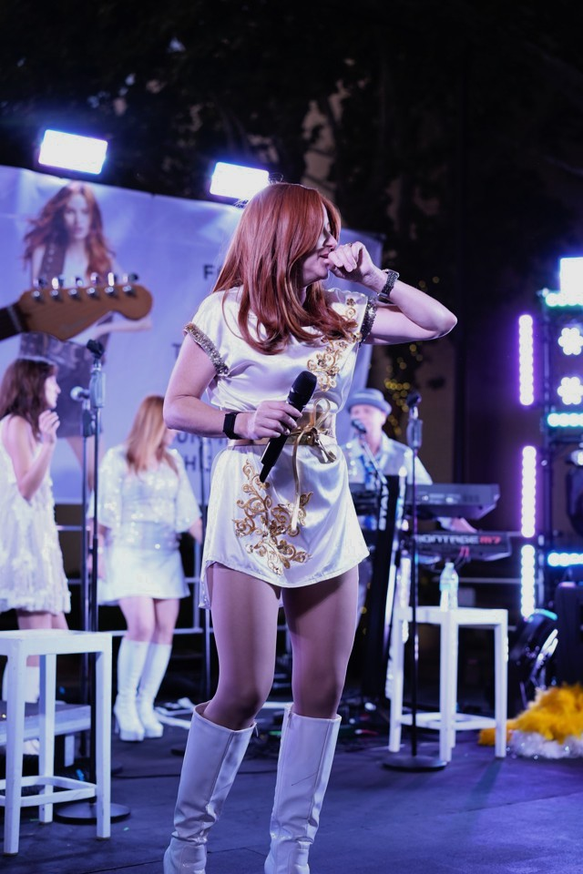 |

[Recipe](recipes/preset-dark-moody-1.iedl) · [Full image](images/preset-dark-moody-1.jpg) · [Resolved report](resolved/preset-dark-moody-1.json)

## Curves &amp; HSL

### RGB tone curve

**Rendered** — Lift the midpoint in one channel; endpoints stay fixed.

| Original | Edited |
| --- | --- |
|  |  |

[Recipe](recipes/curve-rgb.iedl) · [Full image](images/curve-rgb.jpg) · [Resolved report](resolved/curve-rgb.json)

### R tone curve

**Rendered** — Lift the midpoint in one channel; endpoints stay fixed.

| Original | Edited |
| --- | --- |
|  | 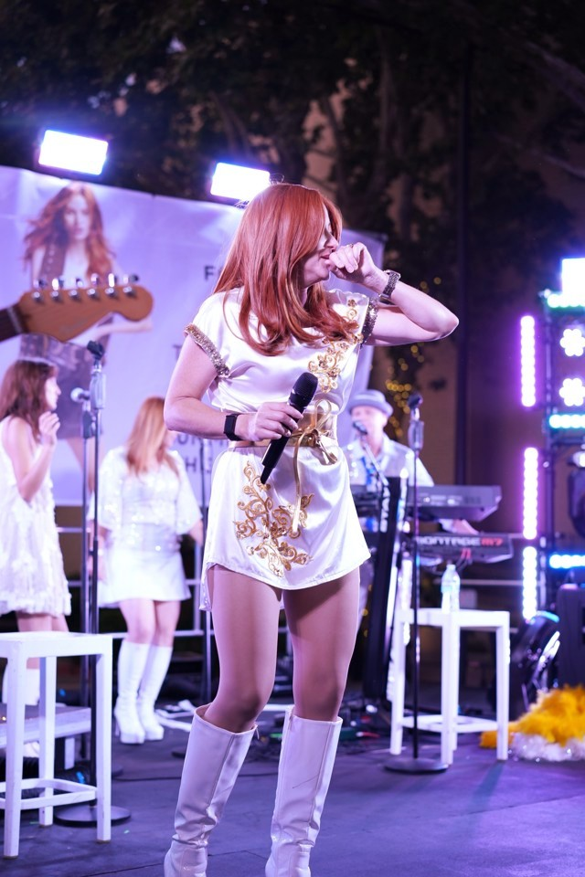 |

[Recipe](recipes/curve-r.iedl) · [Full image](images/curve-r.jpg) · [Resolved report](resolved/curve-r.json)

### G tone curve

**Rendered** — Lift the midpoint in one channel; endpoints stay fixed.

| Original | Edited |
| --- | --- |
|  | 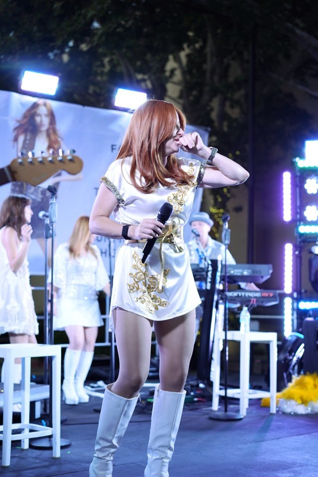 |

[Recipe](recipes/curve-g.iedl) · [Full image](images/curve-g.jpg) · [Resolved report](resolved/curve-g.json)

### B tone curve

**Rendered** — Lift the midpoint in one channel; endpoints stay fixed.

| Original | Edited |
| --- | --- |
|  | 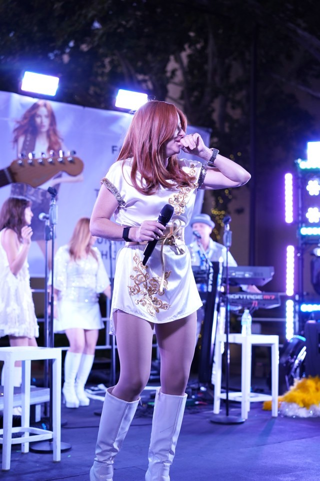 |

[Recipe](recipes/curve-b.iedl) · [Full image](images/curve-b.jpg) · [Resolved report](resolved/curve-b.json)

### Red HSL band

**Rendered** — Only this hue band changes. Bands absent from the photograph can show almost no difference.

| Original | Edited |
| --- | --- |
|  |  |

[Recipe](recipes/hsl-red.iedl) · [Full image](images/hsl-red.jpg) · [Resolved report](resolved/hsl-red.json)

### Orange HSL band

**Rendered** — Only this hue band changes. Bands absent from the photograph can show almost no difference.

| Original | Edited |
| --- | --- |
|  |  |

[Recipe](recipes/hsl-orange.iedl) · [Full image](images/hsl-orange.jpg) · [Resolved report](resolved/hsl-orange.json)

### Yellow HSL band

**Rendered** — Only this hue band changes. Bands absent from the photograph can show almost no difference.

| Original | Edited |
| --- | --- |
|  |  |

[Recipe](recipes/hsl-yellow.iedl) · [Full image](images/hsl-yellow.jpg) · [Resolved report](resolved/hsl-yellow.json)

### Green HSL band

**Rendered** — Only this hue band changes. Bands absent from the photograph can show almost no difference.

| Original | Edited |
| --- | --- |
|  |  |

[Recipe](recipes/hsl-green.iedl) · [Full image](images/hsl-green.jpg) · [Resolved report](resolved/hsl-green.json)

### Aqua HSL band

**Rendered** — Only this hue band changes. Bands absent from the photograph can show almost no difference.

| Original | Edited |
| --- | --- |
|  | 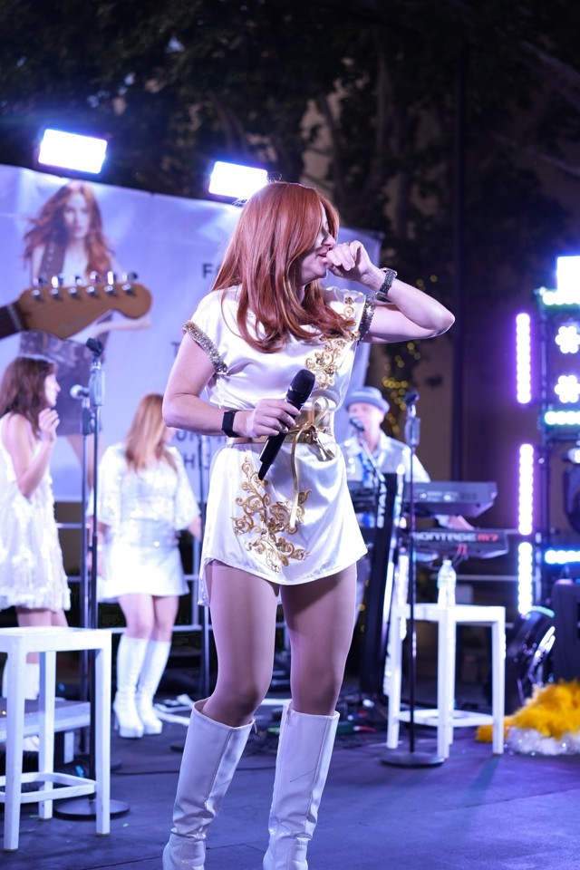 |

[Recipe](recipes/hsl-aqua.iedl) · [Full image](images/hsl-aqua.jpg) · [Resolved report](resolved/hsl-aqua.json)

### Blue HSL band

**Rendered** — Only this hue band changes. Bands absent from the photograph can show almost no difference.

| Original | Edited |
| --- | --- |
|  | 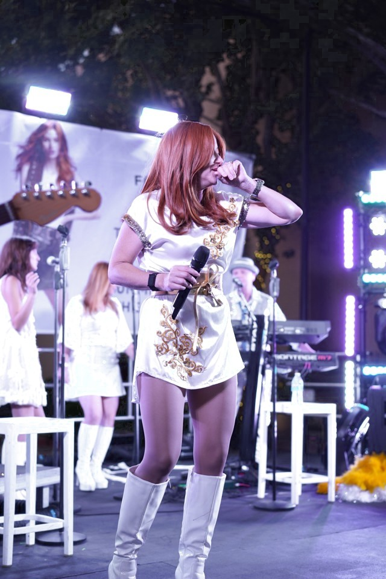 |

[Recipe](recipes/hsl-blue.iedl) · [Full image](images/hsl-blue.jpg) · [Resolved report](resolved/hsl-blue.json)

### Purple HSL band

**Rendered** — Only this hue band changes. Bands absent from the photograph can show almost no difference.

| Original | Edited |
| --- | --- |
|  |  |

[Recipe](recipes/hsl-purple.iedl) · [Full image](images/hsl-purple.jpg) · [Resolved report](resolved/hsl-purple.json)

### Magenta HSL band

**Rendered** — Only this hue band changes. Bands absent from the photograph can show almost no difference.

| Original | Edited |
| --- | --- |
|  |  |

[Recipe](recipes/hsl-magenta.iedl) · [Full image](images/hsl-magenta.jpg) · [Resolved report](resolved/hsl-magenta.json)

## Masks

### Brush mask

**Rendered** — A deliberately visible local exposure change shows coverage. White in the mask preview applies the effect.

| Original | Edited |
| --- | --- |
|  | 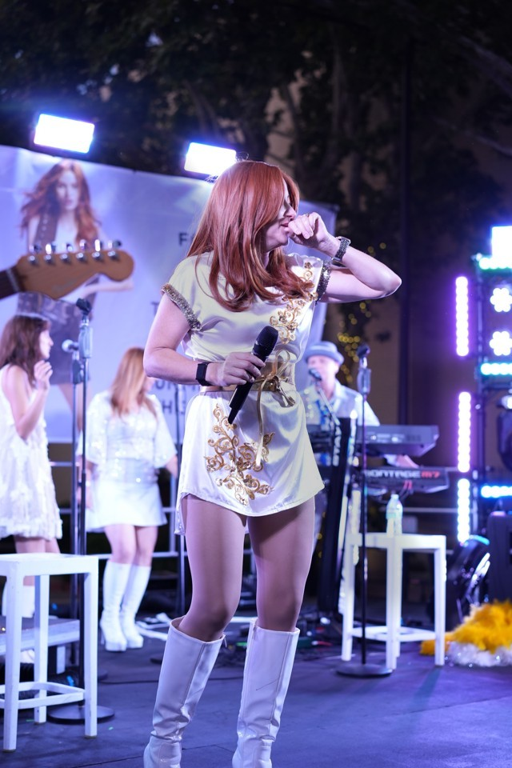 |

[Recipe](recipes/mask-brush.iedl) · [Full image](images/mask-brush.jpg) · [Resolved report](resolved/mask-brush.json) · [Mask](masks/mask-brush.png) · [Replay bundle](bundles/mask-brush.iedl.zip)

### Linear mask

**Rendered** — A deliberately visible local exposure change shows coverage. White in the mask preview applies the effect.

| Original | Edited |
| --- | --- |
|  | 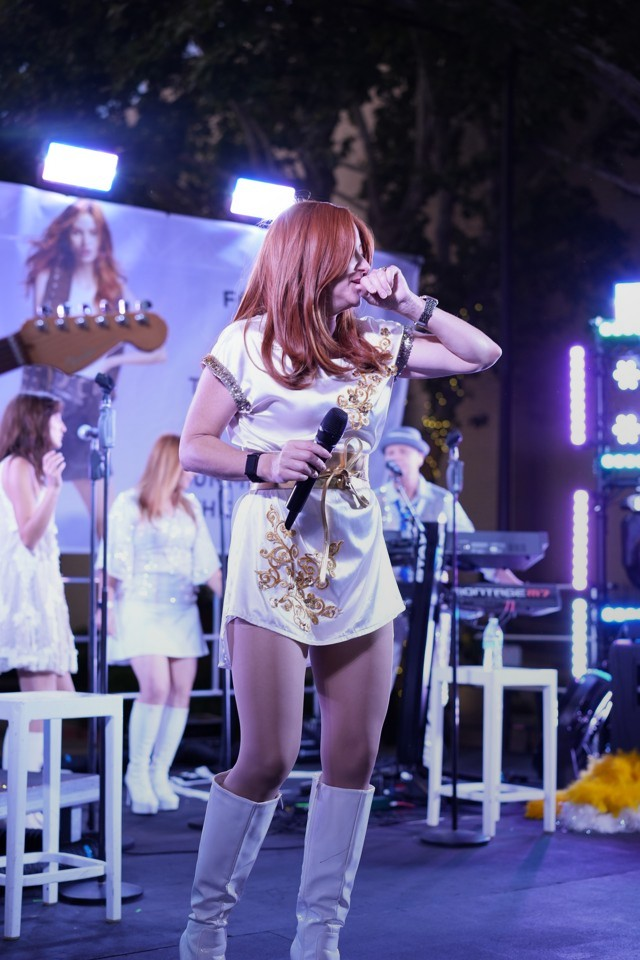 |

[Recipe](recipes/mask-linear.iedl) · [Full image](images/mask-linear.jpg) · [Resolved report](resolved/mask-linear.json) · [Mask](masks/mask-linear.png) · [Replay bundle](bundles/mask-linear.iedl.zip)

### Radial mask

**Rendered** — A deliberately visible local exposure change shows coverage. White in the mask preview applies the effect.

| Original | Edited |
| --- | --- |
|  |  |

[Recipe](recipes/mask-radial.iedl) · [Full image](images/mask-radial.jpg) · [Resolved report](resolved/mask-radial.json) · [Mask](masks/mask-radial.png) · [Replay bundle](bundles/mask-radial.iedl.zip)

### Rectangle mask

**Rendered** — A deliberately visible local exposure change shows coverage. White in the mask preview applies the effect.

| Original | Edited |
| --- | --- |
|  | 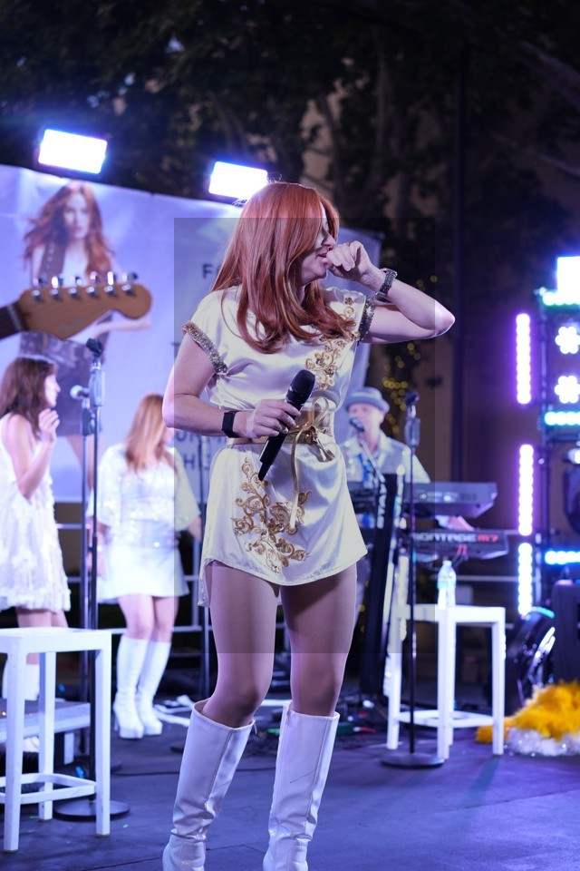 |

[Recipe](recipes/mask-rectangle.iedl) · [Full image](images/mask-rectangle.jpg) · [Resolved report](resolved/mask-rectangle.json) · [Mask](masks/mask-rectangle.png) · [Replay bundle](bundles/mask-rectangle.iedl.zip)

### Ellipse mask

**Rendered** — A deliberately visible local exposure change shows coverage. White in the mask preview applies the effect.

| Original | Edited |
| --- | --- |
|  | 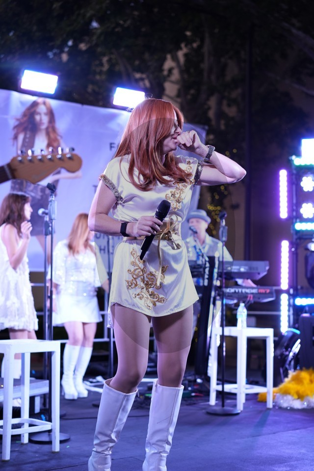 |

[Recipe](recipes/mask-ellipse.iedl) · [Full image](images/mask-ellipse.jpg) · [Resolved report](resolved/mask-ellipse.json) · [Mask](masks/mask-ellipse.png) · [Replay bundle](bundles/mask-ellipse.iedl.zip)

### Lasso mask

**Rendered** — A deliberately visible local exposure change shows coverage. White in the mask preview applies the effect.

| Original | Edited |
| --- | --- |
|  |  |

[Recipe](recipes/mask-lasso.iedl) · [Full image](images/mask-lasso.jpg) · [Resolved report](resolved/mask-lasso.json) · [Mask](masks/mask-lasso.png) · [Replay bundle](bundles/mask-lasso.iedl.zip)

### Polygon mask

**Rendered** — A deliberately visible local exposure change shows coverage. White in the mask preview applies the effect.

| Original | Edited |
| --- | --- |
|  | 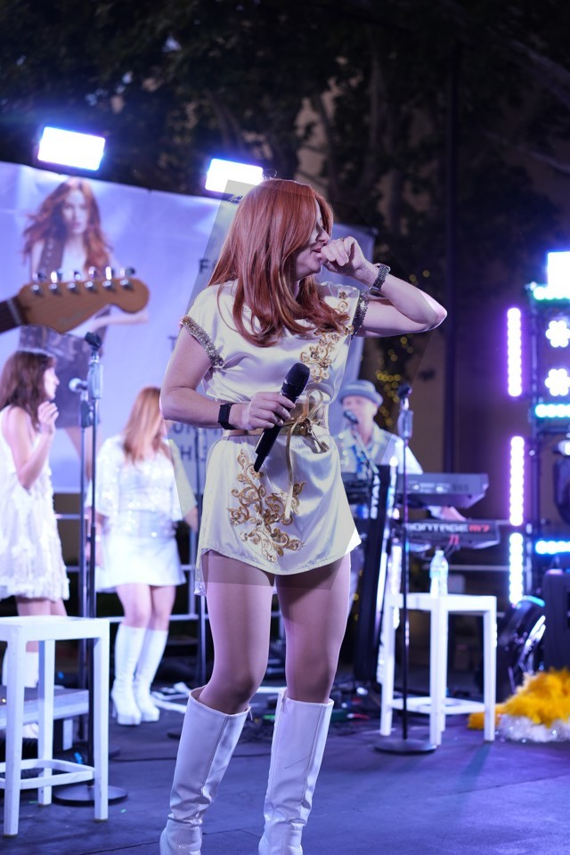 |

[Recipe](recipes/mask-polygon.iedl) · [Full image](images/mask-polygon.jpg) · [Resolved report](resolved/mask-polygon.json) · [Mask](masks/mask-polygon.png) · [Replay bundle](bundles/mask-polygon.iedl.zip)

### Color mask

**Rendered** — A deliberately visible local exposure change shows coverage. White in the mask preview applies the effect.

| Original | Edited |
| --- | --- |
|  | 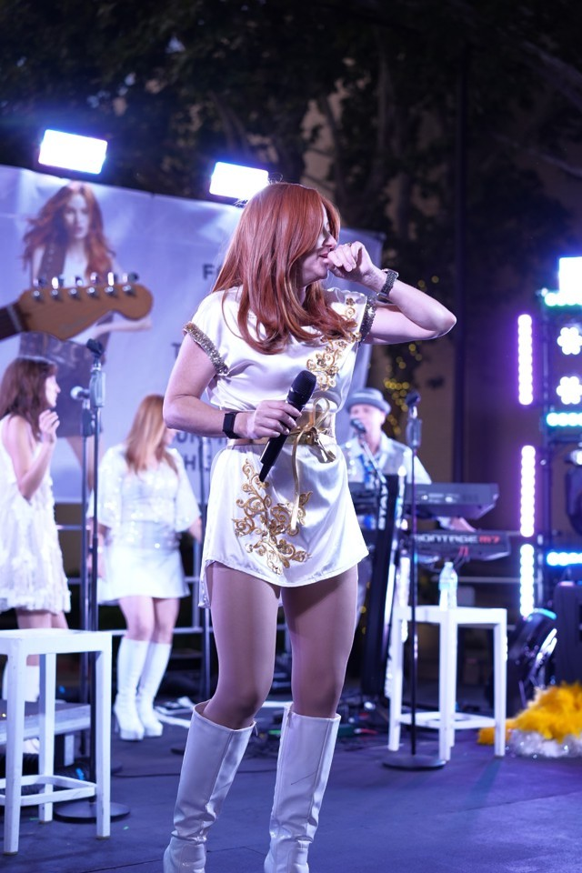 |

[Recipe](recipes/mask-color.iedl) · [Full image](images/mask-color.jpg) · [Resolved report](resolved/mask-color.json) · [Mask](masks/mask-color.png) · [Replay bundle](bundles/mask-color.iedl.zip)

### Luminance mask

**Rendered** — A deliberately visible local exposure change shows coverage. White in the mask preview applies the effect.

| Original | Edited |
| --- | --- |
|  |  |

[Recipe](recipes/mask-luminance.iedl) · [Full image](images/mask-luminance.jpg) · [Resolved report](resolved/mask-luminance.json) · [Mask](masks/mask-luminance.png) · [Replay bundle](bundles/mask-luminance.iedl.zip)

### Raster mask

**Rendered** — A deliberately visible local exposure change shows coverage. White in the mask preview applies the effect.

| Original | Edited |
| --- | --- |
|  | 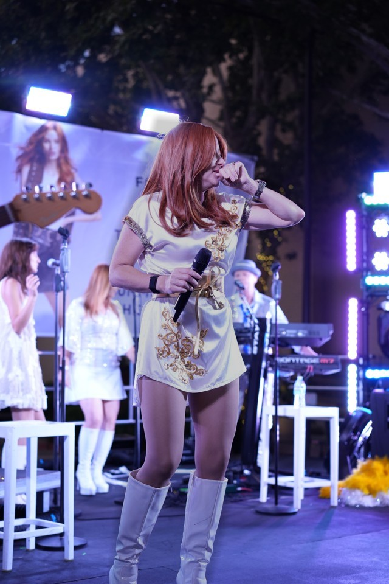 |

[Recipe](recipes/mask-raster.iedl) · [Full image](images/mask-raster.jpg) · [Resolved report](resolved/mask-raster.json) · [Mask](masks/mask-raster.png) · [Replay bundle](bundles/mask-raster.iedl.zip)

### Mask add

**Rendered** — Combine a rectangle and ellipse.

| Original | Edited |
| --- | --- |
|  | 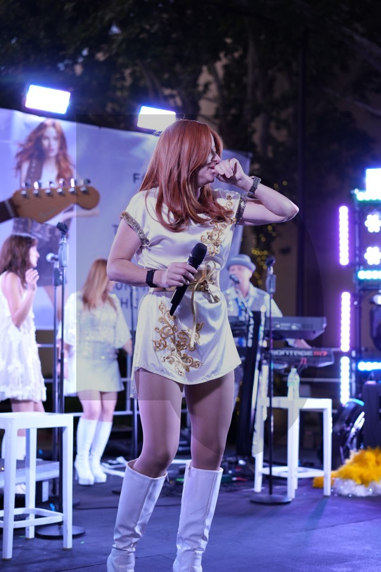 |

[Recipe](recipes/mask-add.iedl) · [Full image](images/mask-add.jpg) · [Resolved report](resolved/mask-add.json) · [Mask](masks/mask-add.png) · [Replay bundle](bundles/mask-add.iedl.zip)

### Mask subtract

**Rendered** — Combine a rectangle and ellipse.

| Original | Edited |
| --- | --- |
|  | 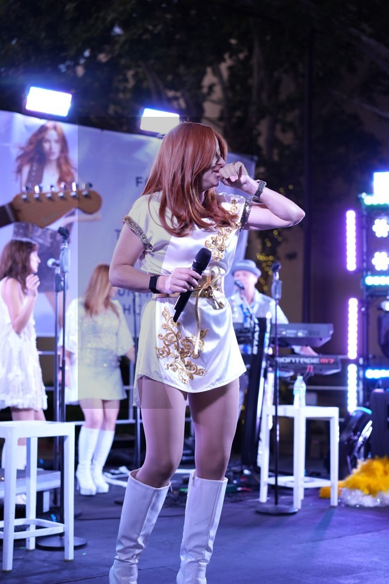 |

[Recipe](recipes/mask-subtract.iedl) · [Full image](images/mask-subtract.jpg) · [Resolved report](resolved/mask-subtract.json) · [Mask](masks/mask-subtract.png) · [Replay bundle](bundles/mask-subtract.iedl.zip)

### Mask intersect

**Rendered** — Combine a rectangle and ellipse.

| Original | Edited |
| --- | --- |
|  | 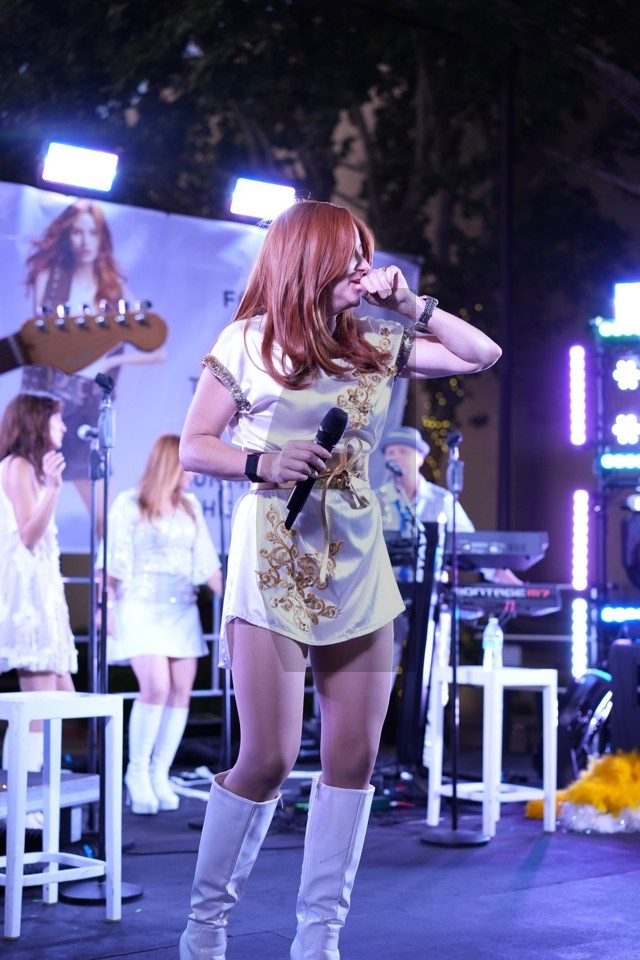 |

[Recipe](recipes/mask-intersect.iedl) · [Full image](images/mask-intersect.jpg) · [Resolved report](resolved/mask-intersect.json) · [Mask](masks/mask-intersect.png) · [Replay bundle](bundles/mask-intersect.iedl.zip)

### Refine: feather

**Rendered** — Hand-drawn region. Bypass applies the adjustment everywhere; density weakens coverage.

| Original | Edited |
| --- | --- |
|  |  |

[Recipe](recipes/refine-feather.iedl) · [Full image](images/refine-feather.jpg) · [Resolved report](resolved/refine-feather.json) · [Mask](masks/refine-feather.png) · [Replay bundle](bundles/refine-feather.iedl.zip)

### Refine: expand

**Rendered** — Hand-drawn region. Bypass applies the adjustment everywhere; density weakens coverage.

| Original | Edited |
| --- | --- |
|  | 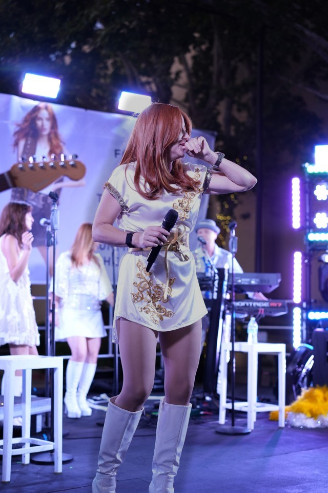 |

[Recipe](recipes/refine-expand.iedl) · [Full image](images/refine-expand.jpg) · [Resolved report](resolved/refine-expand.json) · [Mask](masks/refine-expand.png) · [Replay bundle](bundles/refine-expand.iedl.zip)

### Refine: contract

**Rendered** — Hand-drawn region. Bypass applies the adjustment everywhere; density weakens coverage.

| Original | Edited |
| --- | --- |
|  |  |

[Recipe](recipes/refine-contract.iedl) · [Full image](images/refine-contract.jpg) · [Resolved report](resolved/refine-contract.json) · [Mask](masks/refine-contract.png) · [Replay bundle](bundles/refine-contract.iedl.zip)

### Refine: smooth

**Rendered** — Hand-drawn region. Bypass applies the adjustment everywhere; density weakens coverage.

| Original | Edited |
| --- | --- |
|  |  |

[Recipe](recipes/refine-smooth.iedl) · [Full image](images/refine-smooth.jpg) · [Resolved report](resolved/refine-smooth.json) · [Mask](masks/refine-smooth.png) · [Replay bundle](bundles/refine-smooth.iedl.zip)

### Refine: density

**Rendered** — Hand-drawn region. Bypass applies the adjustment everywhere; density weakens coverage.

| Original | Edited |
| --- | --- |
|  | 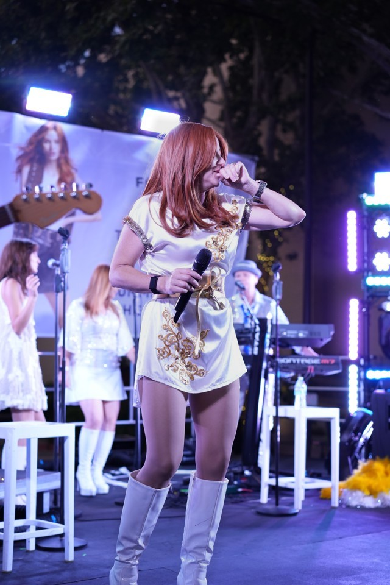 |

[Recipe](recipes/refine-density.iedl) · [Full image](images/refine-density.jpg) · [Resolved report](resolved/refine-density.json) · [Mask](masks/refine-density.png) · [Replay bundle](bundles/refine-density.iedl.zip)

### Refine: invert

**Rendered** — Hand-drawn region. Bypass applies the adjustment everywhere; density weakens coverage.

| Original | Edited |
| --- | --- |
|  | 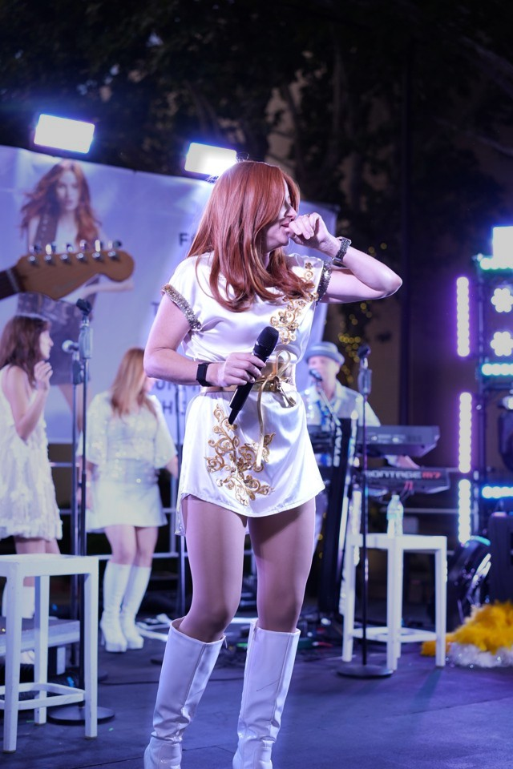 |

[Recipe](recipes/refine-invert.iedl) · [Full image](images/refine-invert.jpg) · [Resolved report](resolved/refine-invert.json) · [Mask](masks/refine-invert.png) · [Replay bundle](bundles/refine-invert.iedl.zip)

### Refine: bypass

**Rendered** — Hand-drawn region. Bypass applies the adjustment everywhere; density weakens coverage.

| Original | Edited |
| --- | --- |
|  | 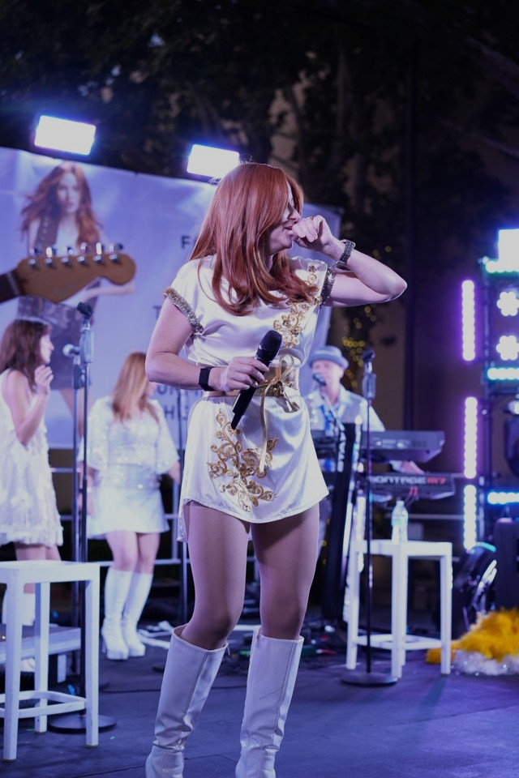 |

[Recipe](recipes/refine-bypass.iedl) · [Full image](images/refine-bypass.jpg) · [Resolved report](resolved/refine-bypass.json) · [Mask](masks/refine-bypass.png) · [Replay bundle](bundles/refine-bypass.iedl.zip)

## Layers

### Normal blend

**Rendered** — Same adjustment, different layer blend mode.

| Original | Edited |
| --- | --- |
|  |  |

[Recipe](recipes/blend-normal.iedl) · [Full image](images/blend-normal.jpg) · [Resolved report](resolved/blend-normal.json)

### Multiply blend

**Rendered** — Same adjustment, different layer blend mode.

| Original | Edited |
| --- | --- |
|  | 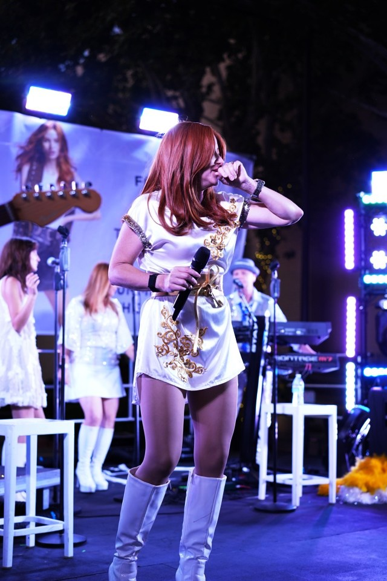 |

[Recipe](recipes/blend-multiply.iedl) · [Full image](images/blend-multiply.jpg) · [Resolved report](resolved/blend-multiply.json)

### Screen blend

**Rendered** — Same adjustment, different layer blend mode.

| Original | Edited |
| --- | --- |
|  | 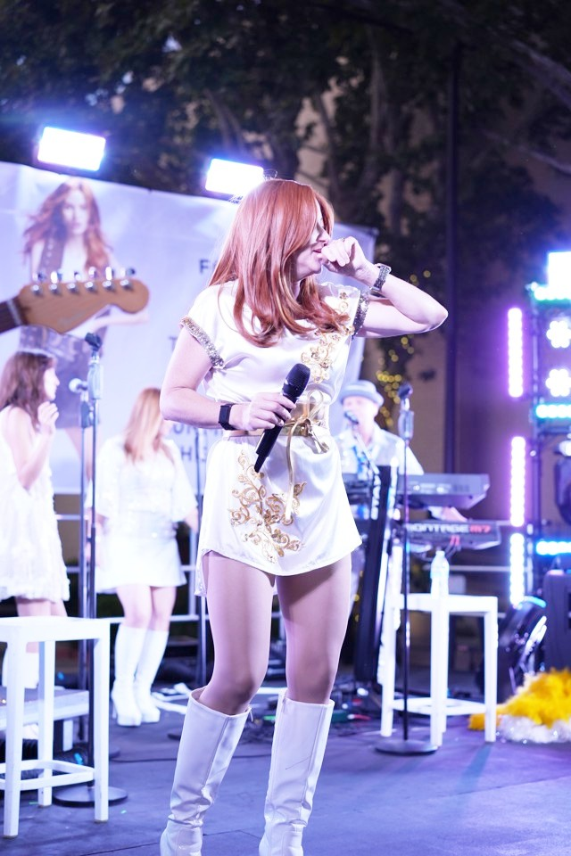 |

[Recipe](recipes/blend-screen.iedl) · [Full image](images/blend-screen.jpg) · [Resolved report](resolved/blend-screen.json)

### Overlay blend

**Rendered** — Same adjustment, different layer blend mode.

| Original | Edited |
| --- | --- |
|  | 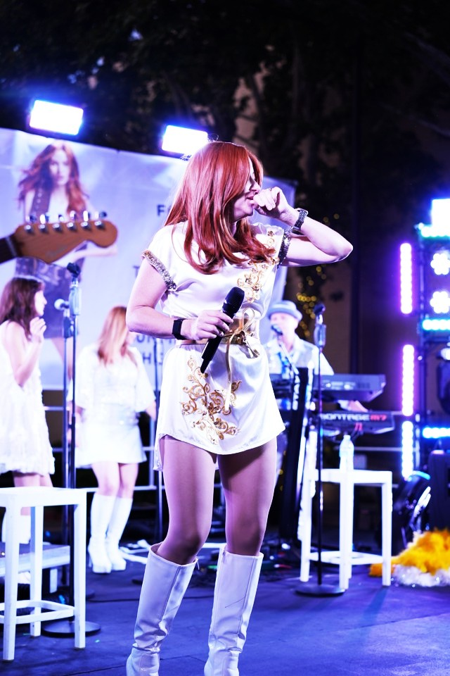 |

[Recipe](recipes/blend-overlay.iedl) · [Full image](images/blend-overlay.jpg) · [Resolved report](resolved/blend-overlay.json)

### Soft-Light blend

**Rendered** — Same adjustment, different layer blend mode.

| Original | Edited |
| --- | --- |
|  | 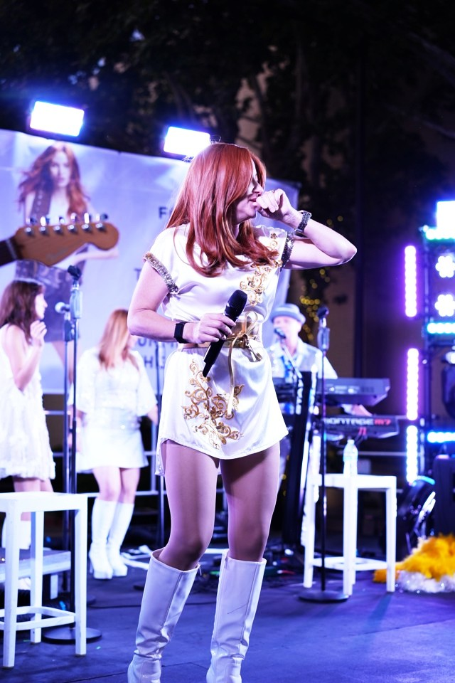 |

[Recipe](recipes/blend-soft-light.iedl) · [Full image](images/blend-soft-light.jpg) · [Resolved report](resolved/blend-soft-light.json)

### Luminosity blend

**Rendered** — Same adjustment, different layer blend mode.

| Original | Edited |
| --- | --- |
|  |  |

[Recipe](recipes/blend-luminosity.iedl) · [Full image](images/blend-luminosity.jpg) · [Resolved report](resolved/blend-luminosity.json)

### Text layer

**Rendered** — Editable text. Font appearance depends on the host fonts.

| Original | Edited |
| --- | --- |
|  | 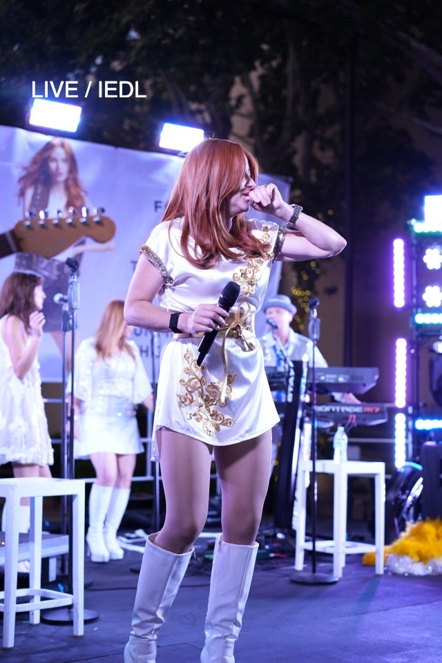 |

[Recipe](recipes/layer-text.iedl) · [Full image](images/layer-text.jpg) · [Resolved report](resolved/layer-text.json)

### Imported raster layer

**Rendered** — Picture-in-picture from an explicitly bound asset.

| Original | Edited |
| --- | --- |
|  | 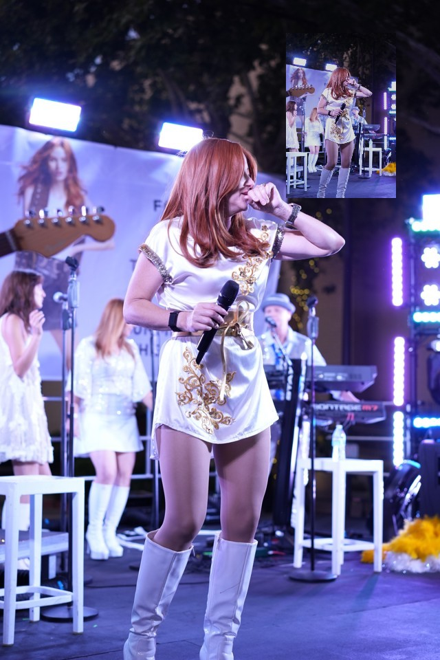 |

[Recipe](recipes/layer-raster.iedl) · [Full image](images/layer-raster.jpg) · [Resolved report](resolved/layer-raster.json)

### Frequency controls

**Rendered** — Reduces high-frequency detail inside a hand-drawn subject mask; not selective skin smoothing.

| Original | Edited |
| --- | --- |
|  |  |

[Recipe](recipes/layer-frequency.iedl) · [Full image](images/layer-frequency.jpg) · [Resolved report](resolved/layer-frequency.json) · [Mask](masks/layer-frequency.png) · [Replay bundle](bundles/layer-frequency.iedl.zip)

### Duplicate, set, order, delete

**Rendered** — The scratch layer is removed. Both remaining layers are editable.

| Original | Edited |
| --- | --- |
|  | 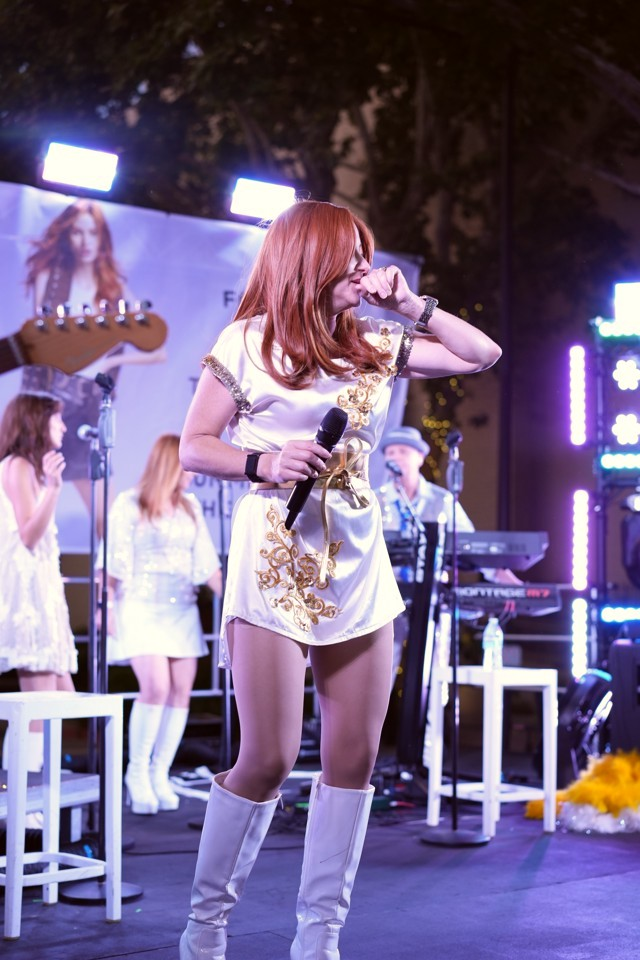 |

[Recipe](recipes/layer-lifecycle.iedl) · [Full image](images/layer-lifecycle.jpg) · [Resolved report](resolved/layer-lifecycle.json)

## Geometry

### Square crop

**Rendered** — Geometry comparison changes framing/orientation; the before and after are shown fitted to the same viewing area.

| Original | Edited |
| --- | --- |
|  |  |

[Recipe](recipes/geometry-square.iedl) · [Full image](images/geometry-square.jpg) · [Resolved report](resolved/geometry-square.json)

### Portrait 4:5

**Rendered** — Geometry comparison changes framing/orientation; the before and after are shown fitted to the same viewing area.

| Original | Edited |
| --- | --- |
|  | 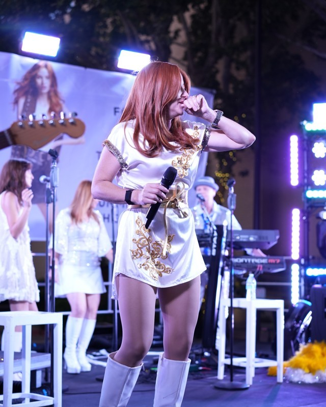 |

[Recipe](recipes/geometry-portrait.iedl) · [Full image](images/geometry-portrait.jpg) · [Resolved report](resolved/geometry-portrait.json)

### Rotate 90°

**Rendered** — Geometry comparison changes framing/orientation; the before and after are shown fitted to the same viewing area.

| Original | Edited |
| --- | --- |
|  |  |

[Recipe](recipes/geometry-rotate.iedl) · [Full image](images/geometry-rotate.jpg) · [Resolved report](resolved/geometry-rotate.json)

### Flip horizontal

**Rendered** — Geometry comparison changes framing/orientation; the before and after are shown fitted to the same viewing area.

| Original | Edited |
| --- | --- |
|  | 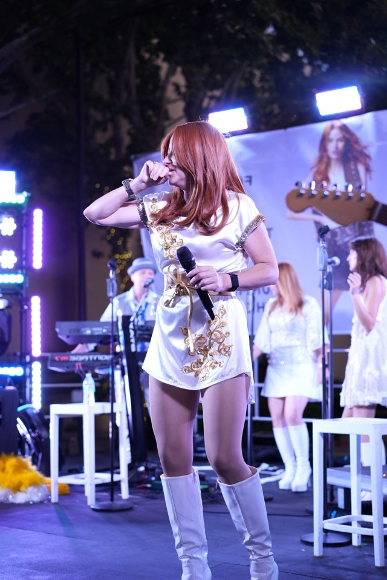 |

[Recipe](recipes/geometry-flip-x.iedl) · [Full image](images/geometry-flip-x.jpg) · [Resolved report](resolved/geometry-flip-x.json)

### Flip vertical

**Rendered** — Geometry comparison changes framing/orientation; the before and after are shown fitted to the same viewing area.

| Original | Edited |
| --- | --- |
|  | 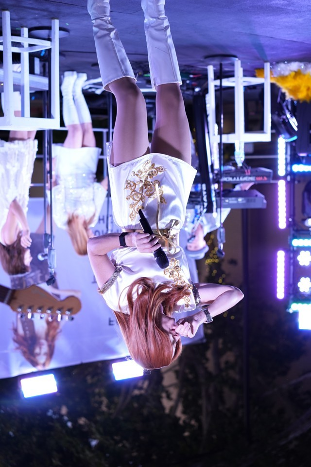 |

[Recipe](recipes/geometry-flip-y.iedl) · [Full image](images/geometry-flip-y.jpg) · [Resolved report](resolved/geometry-flip-y.json)

### Explicit crop

**Rendered** — Geometry comparison changes framing/orientation; the before and after are shown fitted to the same viewing area.

| Original | Edited |
| --- | --- |
|  | 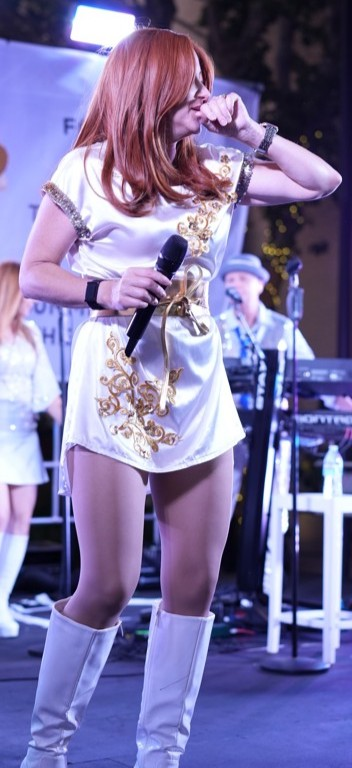 |

[Recipe](recipes/geometry-rectangle.iedl) · [Full image](images/geometry-rectangle.jpg) · [Resolved report](resolved/geometry-rectangle.json)

## Retouch &amp; liquify

### Clone stroke

**Rendered** — Localized tool demonstration near the background water bottle; not an automatic repair. Red-eye has no appropriate target here and can be a no-op.

| Original | Edited |
| --- | --- |
|  |  |

[Recipe](recipes/retouch-clone.iedl) · [Full image](images/retouch-clone.jpg) · [Resolved report](resolved/retouch-clone.json) · [Mask](masks/retouch-clone.png) · [Replay bundle](bundles/retouch-clone.iedl.zip)

### Heal stroke

**Rendered** — Localized tool demonstration near the background water bottle; not an automatic repair. Red-eye has no appropriate target here and can be a no-op.

| Original | Edited |
| --- | --- |
|  |  |

[Recipe](recipes/retouch-heal.iedl) · [Full image](images/retouch-heal.jpg) · [Resolved report](resolved/retouch-heal.json) · [Mask](masks/retouch-heal.png) · [Replay bundle](bundles/retouch-heal.iedl.zip)

### Spot stroke

**Rendered** — Localized tool demonstration near the background water bottle; not an automatic repair. Red-eye has no appropriate target here and can be a no-op.

| Original | Edited |
| --- | --- |
|  |  |

[Recipe](recipes/retouch-spot.iedl) · [Full image](images/retouch-spot.jpg) · [Resolved report](resolved/retouch-spot.json) · [Mask](masks/retouch-spot.png) · [Replay bundle](bundles/retouch-spot.iedl.zip)

### Patch stroke

**Rendered** — Localized tool demonstration near the background water bottle; not an automatic repair. Red-eye has no appropriate target here and can be a no-op.

| Original | Edited |
| --- | --- |
|  |  |

[Recipe](recipes/retouch-patch.iedl) · [Full image](images/retouch-patch.jpg) · [Resolved report](resolved/retouch-patch.json) · [Mask](masks/retouch-patch.png) · [Replay bundle](bundles/retouch-patch.iedl.zip)

### Dodge stroke

**Rendered** — Localized tool demonstration near the background water bottle; not an automatic repair. Red-eye has no appropriate target here and can be a no-op.

| Original | Edited |
| --- | --- |
|  |  |

[Recipe](recipes/retouch-dodge.iedl) · [Full image](images/retouch-dodge.jpg) · [Resolved report](resolved/retouch-dodge.json) · [Mask](masks/retouch-dodge.png) · [Replay bundle](bundles/retouch-dodge.iedl.zip)

### Burn stroke

**Rendered** — Localized tool demonstration near the background water bottle; not an automatic repair. Red-eye has no appropriate target here and can be a no-op.

| Original | Edited |
| --- | --- |
|  |  |

[Recipe](recipes/retouch-burn.iedl) · [Full image](images/retouch-burn.jpg) · [Resolved report](resolved/retouch-burn.json) · [Mask](masks/retouch-burn.png) · [Replay bundle](bundles/retouch-burn.iedl.zip)

### Red-Eye stroke

**Rendered** — Localized tool demonstration near the background water bottle; not an automatic repair. Red-eye has no appropriate target here and can be a no-op.

| Original | Edited |
| --- | --- |
|  |  |

[Recipe](recipes/retouch-red-eye.iedl) · [Full image](images/retouch-red-eye.jpg) · [Resolved report](resolved/retouch-red-eye.json) · [Mask](masks/retouch-red-eye.png) · [Replay bundle](bundles/retouch-red-eye.iedl.zip)

### Liquify stroke

**Rendered** — Localized tool demonstration near the background water bottle; not an automatic repair. Red-eye has no appropriate target here and can be a no-op.

| Original | Edited |
| --- | --- |
|  |  |

[Recipe](recipes/retouch-liquify.iedl) · [Full image](images/retouch-liquify.jpg) · [Resolved report](resolved/retouch-liquify.json) · [Mask](masks/retouch-liquify.png) · [Replay bundle](bundles/retouch-liquify.iedl.zip)

### Liquify-Smooth stroke

**Rendered** — Localized tool demonstration near the background water bottle; not an automatic repair. Red-eye has no appropriate target here and can be a no-op.

| Original | Edited |
| --- | --- |
|  |  |

[Recipe](recipes/retouch-liquify-smooth.iedl) · [Full image](images/retouch-liquify-smooth.jpg) · [Resolved report](resolved/retouch-liquify-smooth.json) · [Mask](masks/retouch-liquify-smooth.png) · [Replay bundle](bundles/retouch-liquify-smooth.iedl.zip)

### Reconstruct stroke

**Rendered** — Localized tool demonstration near the background water bottle; not an automatic repair. Red-eye has no appropriate target here and can be a no-op.

| Original | Edited |
| --- | --- |
|  |  |

[Recipe](recipes/retouch-reconstruct.iedl) · [Full image](images/retouch-reconstruct.jpg) · [Resolved report](resolved/retouch-reconstruct.json) · [Mask](masks/retouch-reconstruct.png) · [Replay bundle](bundles/retouch-reconstruct.iedl.zip)

### Liquify freeze region

**Rendered** — The hand-drawn freeze mask protects the repair region.

| Original | Edited |
| --- | --- |
|  |  |

[Recipe](recipes/liquify-freeze.iedl) · [Full image](images/liquify-freeze.jpg) · [Resolved report](resolved/liquify-freeze.json) · [Mask](masks/liquify-freeze.png) · [Replay bundle](bundles/liquify-freeze.iedl.zip)

## Analysis &amp; automation

### Auto exposure

**Rendered** — Measured from this source. Colored stage lights can mislead neutral-light assumptions; a valid automatic result still needs review.

| Original | Edited |
| --- | --- |
|  |  |

[Recipe](recipes/auto-exposure.iedl) · [Full image](images/auto-exposure.jpg) · [Resolved report](resolved/auto-exposure.json)

### Auto white-balance

**Rendered** — Runtime 1.1 preserves this concert lighting: mixed-color evidence, 6.1% candidate neutrals, consistency 0.084, and zero applied correction. The former global green cast is avoided. This is intentional abstention, not a claim that the lighting is neutral.

| Original | Edited |
| --- | --- |
|  | 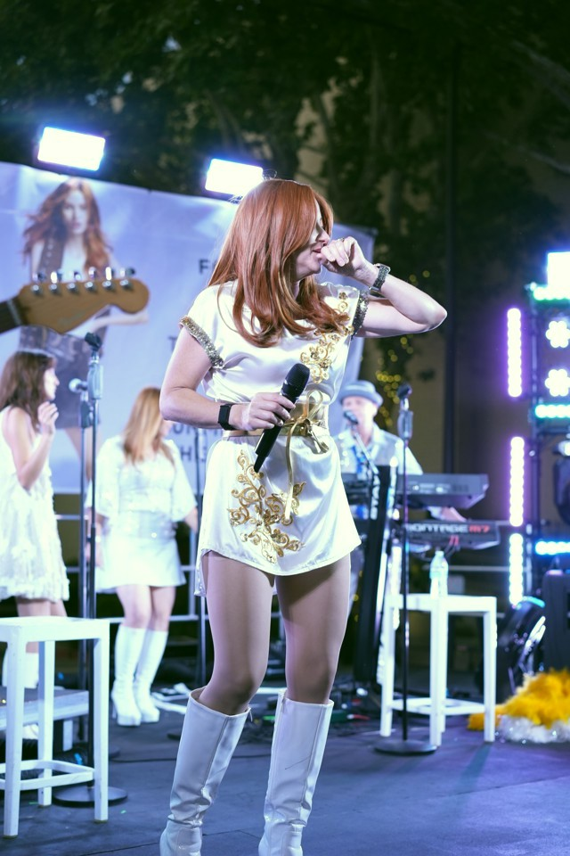 |

[Recipe](recipes/auto-white-balance.iedl) · [Full image](images/auto-white-balance.jpg) · [Resolved report](resolved/auto-white-balance.json)

### Auto vibrance

**Rendered** — Measured from this source. Colored stage lights can mislead neutral-light assumptions; a valid automatic result still needs review.

| Original | Edited |
| --- | --- |
|  |  |

[Recipe](recipes/auto-vibrance.iedl) · [Full image](images/auto-vibrance.jpg) · [Resolved report](resolved/auto-vibrance.json)

### Auto baseline

**Rendered** — Measured from this source. Colored stage lights can mislead neutral-light assumptions; a valid automatic result still needs review.

| Original | Edited |
| --- | --- |
|  |  |

[Recipe](recipes/auto-baseline.iedl) · [Full image](images/auto-baseline.jpg) · [Resolved report](resolved/auto-baseline.json)

### Subject-local baseline

**Rendered** — Local metering of a hand-drawn subject region, not semantic subject detection.

| Original | Edited |
| --- | --- |
|  |  |

[Recipe](recipes/auto-local.iedl) · [Full image](images/auto-local.jpg) · [Resolved report](resolved/auto-local.json) · [Mask](masks/auto-local.png) · [Replay bundle](bundles/auto-local.iedl.zip)

### Mask geometry analysis

**Rendered** — Analysis changes no pixels. Open the resolved report to inspect mask coverage and centroid.

| Original | Edited |
| --- | --- |
|  |  |

[Recipe](recipes/analysis-mask.iedl) · [Full image](images/analysis-mask.jpg) · [Resolved report](resolved/analysis-mask.json) · [Mask](masks/analysis-mask.png) · [Replay bundle](bundles/analysis-mask.iedl.zip)

### Magic wand

**Rendered** — Contiguous selection measured from the dark upper-left background.

| Original | Edited |
| --- | --- |
|  |  |

[Recipe](recipes/wand.iedl) · [Full image](images/wand.jpg) · [Resolved report](resolved/wand.json) · [Mask](masks/wand.png) · [Replay bundle](bundles/wand.iedl.zip)

### Typed recipe parameters

**Rendered** — Override with --param warmth=20 --param strength=0.7; no embedded code.

| Original | Edited |
| --- | --- |
|  |  |

[Recipe](recipes/parameters.iedl) · [Full image](images/parameters.jpg) · [Resolved report](resolved/parameters.json)

## Output &amp; assets

### PNG output

**Rendered** — Download the real rendered output to inspect the codec.

| Original | Edited |
| --- | --- |
|  |  |

[Recipe](recipes/output-png.iedl) · [Full image](images/output-png.png) · [Resolved report](resolved/output-png.json)

### WEBP output

**Rendered** — Download the real rendered output to inspect the codec.

| Original | Edited |
| --- | --- |
|  |  |

[Recipe](recipes/output-webp.iedl) · [Full image](images/output-webp.webp) · [Resolved report](resolved/output-webp.json)

## Authenticated APIs

### AI subject selection

**Recipe only** — Recipe only; not executed. Requires a matching library media ID and backend access. This photo contains no visible sky; sky selection is not a suitable photographic test.

No edited image is available for this example.

[Recipe](recipes/remote-select-subject.iedl)

### AI background selection

**Recipe only** — Recipe only; not executed. Requires a matching library media ID and backend access. This photo contains no visible sky; sky selection is not a suitable photographic test.

No edited image is available for this example.

[Recipe](recipes/remote-select-background.iedl)

### AI sky selection

**Recipe only** — Recipe only; not executed. Requires a matching library media ID and backend access. This photo contains no visible sky; sky selection is not a suitable photographic test.

No edited image is available for this example.

[Recipe](recipes/remote-select-sky.iedl)

### AI skin selection

**Recipe only** — Recipe only; not executed. Requires a matching library media ID and backend access. This photo contains no visible sky; sky selection is not a suitable photographic test.

No edited image is available for this example.

[Recipe](recipes/remote-select-skin.iedl)

### AI object selection

**Recipe only** — Recipe only; not executed. Requires a matching library media ID and backend access. This photo contains no visible sky; sky selection is not a suitable photographic test.

No edited image is available for this example.

[Recipe](recipes/remote-select-object.iedl)

### Magic Eraser

**Recipe only** — Recipe only; not executed. Hand-drawn bottle region. Uses the authenticated backend; may incur credits.

No edited image is available for this example.

[Recipe](recipes/remote-erase.iedl)

### Masked generative edit

**Recipe only** — Recipe only; not executed. Hand-drawn bottle region. Uses the authenticated backend; may incur credits.

No edited image is available for this example.

[Recipe](recipes/remote-generative-edit.iedl)

---

Generated by `build_gallery.py` alongside `index.html`. [Photo and license](README.md#photo-and-license).
