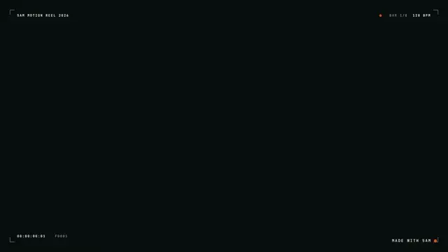
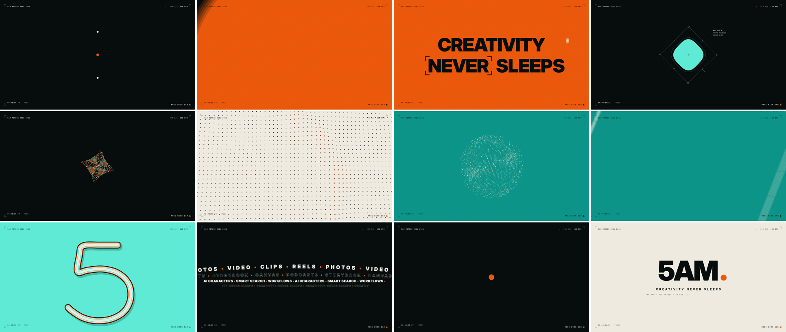
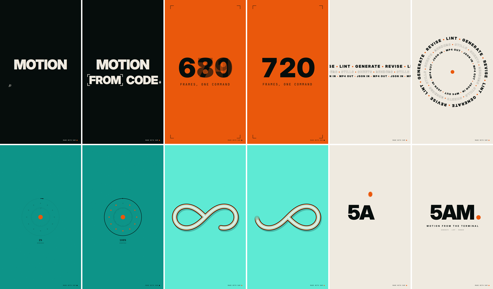
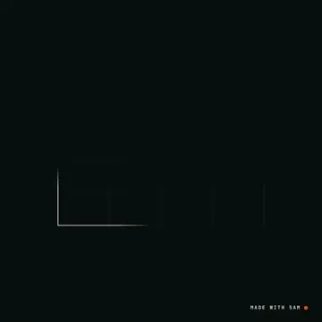
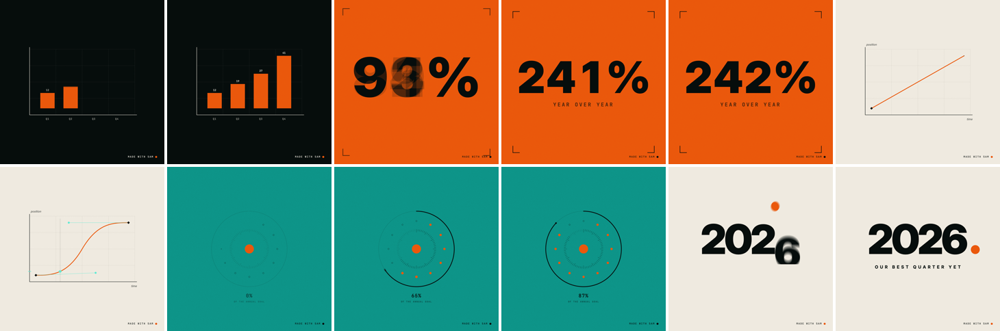
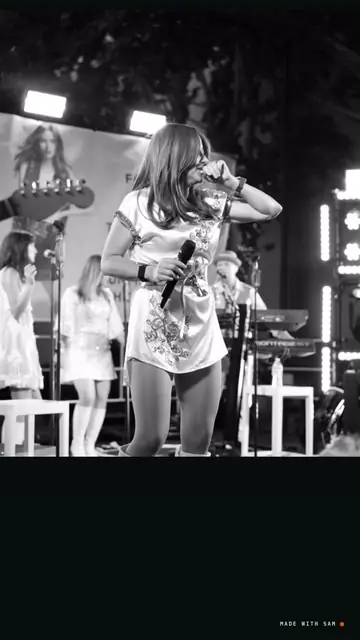
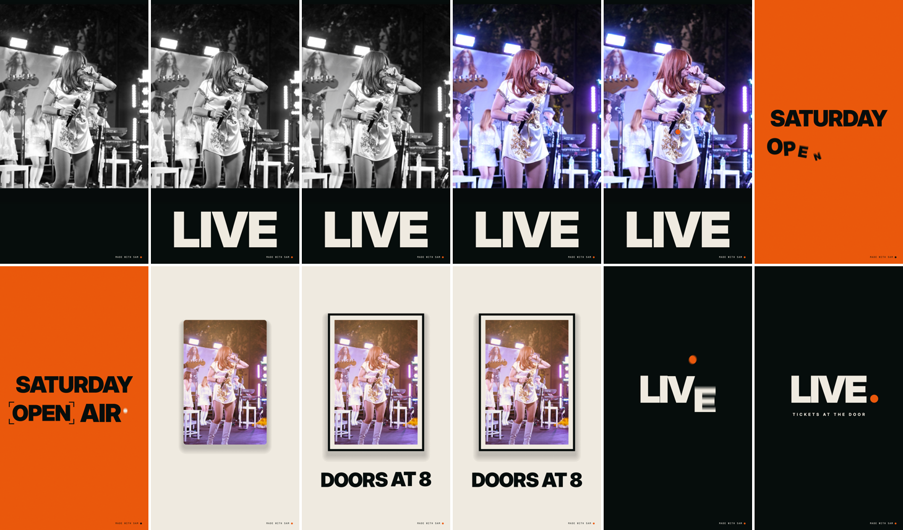

# Motion films: samples for `5am motion`

Four MotionDoc films for [`5am motion`](../../docs/motion.md). Each one plays below as
a silent preview; click it for the MP4 with its music, exported by `5am motion render`
exactly as you would export it. Under each is a contact sheet of 12 evenly spaced frames
from `5am motion sheet` (free, local). Lint them, look at them, revise them, or export
them yourself.

Every film here lints clean (`fixes: 0`, no warnings). They were written from the
Motion engine's scene recipes and checked by eye on their sheets; no model call made
them. Requires CLI v1.5.0 or later and the optional runtime (`5am update --runtime-only`).

## The films

### [`five-am-reel.motion.json`](five-am-reel.motion.json): 16:9, 15 s, 128 BPM

The 5AM showreel the engine was built to reproduce: a clock, kinetic type through a
circle reveal, a shape morphing in a live gizmo, a dot field that tilts into terrain,
a 3D point cloud, a ribbon writing a 5, text rings, and an end card whose dot hops
across the letters. Eight scenes, one per bar, with the designer HUD on.

[](https://assets.5am.app/blog-assets/cli-motion-five-am-reel.mp4)

Watch it with sound: [five-am-reel.mp4](https://assets.5am.app/blog-assets/cli-motion-five-am-reel.mp4) (1920x1080, 60 fps, 12 MB).



### [`terminal-launch.motion.json`](terminal-launch.motion.json): 9:16, 12 s, 120 BPM

A vertical launch film: a three-beat headline, a counter, text rings, a progress
dial, a ribbon and an end card.

[](https://assets.5am.app/blog-assets/cli-motion-terminal-launch.mp4)

Watch it with sound: [terminal-launch.mp4](https://assets.5am.app/blog-assets/cli-motion-terminal-launch.mp4) (1080x1920, 60 fps, 5.3 MB).



### [`data-story.motion.json`](data-story.motion.json): 1:1, 10 s, 120 BPM

A square data story: bars that grow with their values, a counter, an easing curve
with a playhead, a dial and an end card.

[](https://assets.5am.app/blog-assets/cli-motion-data-story.mp4)

Watch it with sound: [data-story.mp4](https://assets.5am.app/blog-assets/cli-motion-data-story.mp4) (1080x1080, 60 fps, 2 MB).



### [`concert-promo.motion.json`](concert-promo.motion.json): 9:16, 10 s, 120 BPM

A film built around a photo: it enters in black and white with a slow push-in and
relights to colour, then returns as a framed print. The photo is the concert
photograph from the [image-edit examples](../image-edit/README.md#photo-and-license),
referenced from the film as `file:../image-edit/source.jpg` (paths are relative to
the film file, so keep this folder beside `image-edit/`).

[](https://assets.5am.app/blog-assets/cli-motion-concert-promo.mp4)

Watch it with sound: [concert-promo.mp4](https://assets.5am.app/blog-assets/cli-motion-concert-promo.mp4) (1080x1920, 60 fps, 4.1 MB).



## Try them

From this folder:

```sh
5am motion lint terminal-launch.motion.json
5am motion sheet terminal-launch.motion.json -o /tmp/launch.png --count 24
5am motion stills concert-promo.motion.json --times 1,5,9 --out-dir /tmp/stills

# Make it yours (uses Gemini access), then look again
5am motion revise terminal-launch.motion.json "make it about my bakery, Rise & Shine" -o /tmp/bakery.motion.json
5am motion sheet /tmp/bakery.motion.json -o /tmp/bakery.png

# Export (20 AI credits); --dry-run first shows the price and checks every font and photo
5am motion render /tmp/bakery.motion.json -o /tmp/bakery.mp4 --dry-run
5am motion render /tmp/bakery.motion.json -o /tmp/bakery.mp4 --fps 30
```

`--format` re-lays out a film for another shape without edits:

```sh
5am motion sheet data-story.motion.json -o /tmp/data-wide.png --format 16:9
```

A revision written to another folder (like `/tmp` above) re-points a film's local
photo paths, so `concert-promo` revised into `/tmp` still finds its photo.

## Rebuild the sheets and previews

The sheets are free. The previews come from exported MP4s, so rebuilding them costs
20 AI credits per film:

```sh
for f in five-am-reel terminal-launch data-story concert-promo; do
  5am motion sheet "$f.motion.json" -o "sheets/$f.png" --count 12 --overwrite
  5am motion render "$f.motion.json" -o "/tmp/$f.mp4" --overwrite
  ffmpeg -y -i "/tmp/$f.mp4" -an -c:v libwebp_anim -q:v 70 -compression_level 6 -loop 0 \
    -vf "fps=15,scale='if(gt(iw,ih),-2,360)':'if(gt(iw,ih),360,-2)':flags=lanczos" "previews/$f.webp"
done
```

## License

The films and this guide are examples under the repository's Apache 2.0 license.
The concert photograph has separate rights: see its
[provenance note](../image-edit/README.md#photo-and-license). The contact sheet,
preview and MP4 of `concert-promo` show that photograph.
